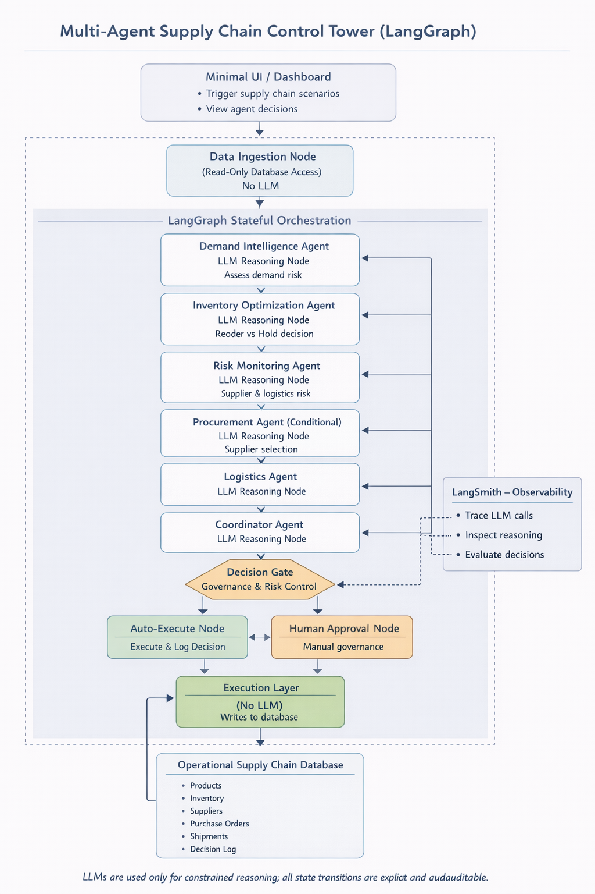

## Multi-Agent Supply Chain Control Tower


A minimal, educational **Multi-Agent Supply Chain Control Tower** built with Python, LangGraph, SQLAlchemy, and SQLite.  
The system focuses on **explainable decisions**, **simple architecture**, and a **thin UI for inspection**, not production use.

This project is designed as a **thin, elegant UI** on top of a **well-structured multi-agent backend**, ideal for demos, interviews, and experimentation with agentic workflows in real-world operations.

---

## Features

- **Multi-agent architecture** with distinct responsibilities:
  - **Demand Agent** – Classifies demand risk and explains its reasoning.
  - **Inventory Agent** – Decides whether to reorder and how much.
  - **Risk Agent** – Evaluates supplier and logistics risk.
  - **Logistics Agent** – Decides whether to expedite shipments.
  - **Coordinator Agent** – Synthesizes all signals into a final decision.
- **LangGraph workflow** (`create_supply_chain_graph`) that:
  - Ingests a database snapshot.
  - Runs agents in a structured flow.
  - Routes through a **decision gate** and **human approval** when needed.
- **Governance & safety layer**:
  - Risk-aware decision routing.
  - Optional human-in-the-loop approval before execution.
- **Streamlit UI**:
  - One-click “Run Supply Chain Decision Cycle”.
  - Rich visualization of state, reasoning, and final outcomes.
  - Governance metrics clearly surfaced.

---

## Project Structure

At a high level:

- **`src/`** – Core backend logic
  - `graph.py` – LangGraph state machine wiring nodes and agents.
  - `state.py` – Typed state model for the workflow.
  - `agents/` – Agent node implementations (demand, inventory, risk, logistics, coordinator).
  - `nodes/` – Non-agent nodes (data ingestion, decision gate, execution, human approval).
  - `db_service.py`, `db_init.py`, `models.py` – SQLite-based supply chain data and schema.
  - `backend_interface.py` – Simple entry point the UI calls (`run_one_cycle`).
  - `main.py` – CLI / console entry point for running async multi-product cycles.
- **`ui/`** – Streamlit visualization layer
  - `app.py` – Main Streamlit app.
  - `helpers.py` – UI formatting helpers (currency, percentages, truncation, etc.).
- **`data/`**
  - `supply_chain.db` – SQLite database used by the workflow.
- **Root**
  - `requirements.txt` – Python dependencies.
  - `.env` (not committed) – API keys and environment config.

---

## Architecture Overview

<p align="center">
  
</p>

## Getting Started

### 1. Clone & set up environment

```bash
git clone <your-repo-url> "Supply Chain Agent"
cd "Supply Chain Agent"

python -m venv venv
venv\Scripts\activate  # On Windows
# source venv/bin/activate  # On macOS / Linux

pip install -r requirements.txt
pip install streamlit
```

> **Note:** The core requirements for the backend are in `requirements.txt`. Streamlit is installed separately for the UI.

### 2. Configure environment variables

Create a `.env` file in the project root (same folder as `requirements.txt`) and set your model / tracing keys, e.g.:

```bash
OPENROUTER_API_KEY=your_key_here
LANGCHAIN_TRACING_V2=true
LANGCHAIN_PROJECT="supply-chain-control-tower"
```

The exact keys you need may depend on which LLM provider you use via `langchain-openai` / `langgraph`.

### 3. Initialize / seed the database (optional if already present)

If you want to (re)initialize the demo data from code, you can run the backend entrypoint:

```bash
venv\Scripts\activate
python -m src.main
```

This will:

- Initialize the SQLite database.
- Seed example products, suppliers, orders, and shipments.
- Run an async decision cycle for all products and print a text summary.

---

## Running the Streamlit Control Tower UI

From the project root:

```bash
venv\Scripts\activate
streamlit run ui/app.py
```

Then open the browser tab Streamlit launches (typically `http://localhost:8501`).

In the UI you can:

- Select a **Product** from the dropdown.
- Click *** Run Supply Chain Decision Cycle”**.
- Inspect:
  - **Supply Chain State** – inventory, suppliers, POs, shipments.
  - **Agent Reasoning** – collapsible sections for each agent’s output.
  - **Final Decision** – decision type, quantity, supplier, expedite flag, and explanation.
  - **Governance & Safety** – decision risk, whether human approval was required, and approval status.

This makes it very clear *why* the system chose a certain action, not just *what* it decided.

---

## Architecture & Flow

1. **Data Ingestion**
   - Reads the current snapshot from `supply_chain.db` (product, inventory, suppliers, POs, shipments).
2. **Agent Layer**
   - Each agent receives the shared state and writes its own reasoning / recommendations into `agent_outputs`.
3. **Coordinator Agent**
   - Consumes the individual agent outputs and produces a **final decision** and natural-language explanation.
4. **Decision Gate**
   - Evaluates risk and decides whether to:
     - **Auto-execute**, or
     - Route to **Human Approval**.
5. **Human Approval Node**
   - Represents a governance checkpoint where a human can approve or block execution.
6. **Execution Node**
   - On approval (or low-risk auto-execution), updates downstream state (e.g., placing orders) and returns execution status.

All of this is assembled into a **LangGraph `StateGraph`** in `graph.py`, which the UI calls via `backend_interface.run_one_cycle`.

---

## CLI / Backend-Only Usage

If you prefer to run the decision system without the UI (e.g., for testing or demos in a terminal), you can use:

```bash
venv\Scripts\activate
python -m src.main
```

This will:

- Build the LangGraph workflow.
- Run the cycle for multiple products in parallel.
- Print a structured summary to the console for each product.

---

##  Governance & Safety Notes

- The **decision gate** and **human approval node** model real-world governance:
  - High-risk decisions can require a human approver.
  - Metrics surface whether a decision needed approval and the final status.
- The UI exposes:
  - **Decision risk level**.
  - Whether **human approval was required**.
  - The **approval status** / human feedback.


---

##  Technologies Used

- **Python 3.12+**
- **LangGraph** for graph-based multi-agent orchestration.
- **LangChain / langchain-openai** for LLM tooling and integrations.
- **SQLite + SQLAlchemy** for the supply chain data model.
- **Streamlit** for the interactive control tower UI.
- **Pydantic** for typed models and validation.

---

##  Next Steps / Ideas

- Plug into a real transactional system instead of the demo SQLite database.
- Add more products, suppliers, and realistic lead-time / risk modeling.
- Integrate external signals (e.g., logistics disruption feeds, pricing APIs).
- Add a scenario selector in the UI (e.g., “port strike”, “supplier outage”, “demand spike”).


